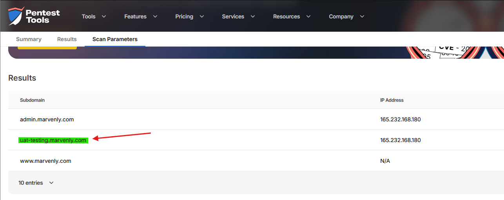
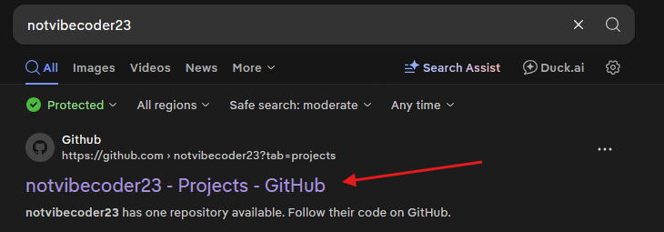
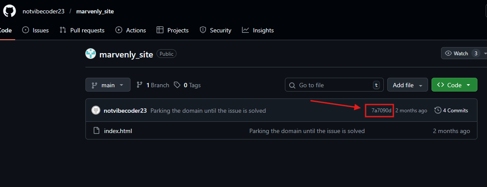
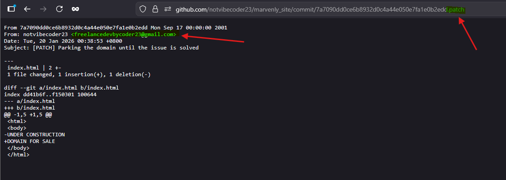
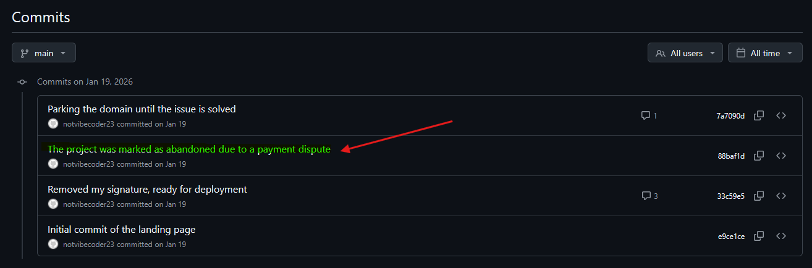
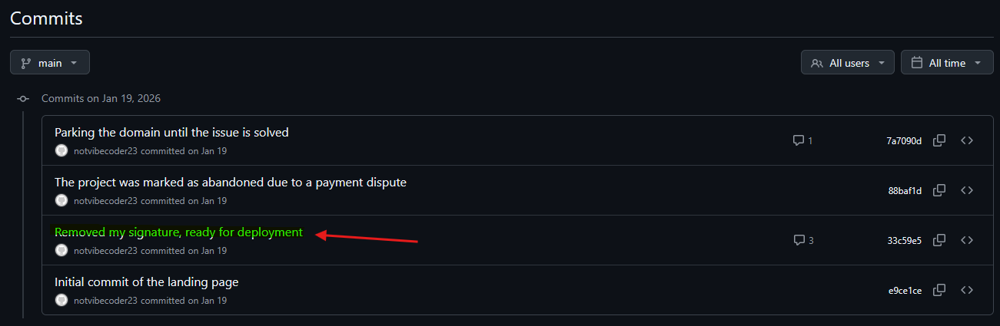
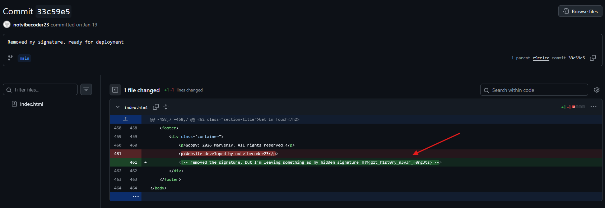

# Challenge Overview
---
**Challenge:** [Dev Diaries](https://tryhackme.com/room/devdiaries)  
**Platform:** TryHackMe  
**Category:** OSINT  
**Difficulty:** Easy  
**Tools Used:** pentest-tools.com, GitHub  

# Summary
---
This lab involved analyzing a vulnerable development environment to uncover information about a developer and a development environment. Initial enumeration of the target domain revealed a hidden subdomain hosting a development version of the website. Analysis of the site exposed the developer's identify, which was then used to locate their GitHub profile. By reviewing repositories and commit history, additional details like the developer's email address were obtained through patch data. Further inspection of commit messages provided insights into development decisions, including the removal of source code. Deep analysis into repository history led to the discovery of a hidden flag within a specific commit.  

# Scenario
---
We have just launched a website developed by a freelance developer. The source code was not shared with us, and the developer has since disappeared without handing it over.  

Despite this, traces of the development process and earlier versions of the website may still exist online.  

You are only given the website's primary domain as a starting point: marvenly.com  

# Challenge
---
## What is the subdomain where the development version of the website is hosted?
  
I used pentest-tools.com to enumerate the primary domain marvenly.com to find any sub-domains.  

## What is the GitHub username of the developer?
  
Upon navigating to `uat-testing.marvenly.com`, if we scroll down we can see the name of the developer.  

## What is the developer's email address?
  
Run a quick search on the developer's name to find the developer's Github profile.  

  
Search through the notvibecoder123's repository to find marvenly_site and click on the latest commit ID.  

  
In the URL, add `.patch` to the end of the URL and we obtain the developer's email address.  

## What reason did the developer mention in the commit history for removing the source code?
  
Look in the commit history to find the reasoning for removing the source code.  

## What is the value of the hidden flag?
  
  
Digging through each of the commit, the specific commit ID `33c59e5` has the hidden flag.  