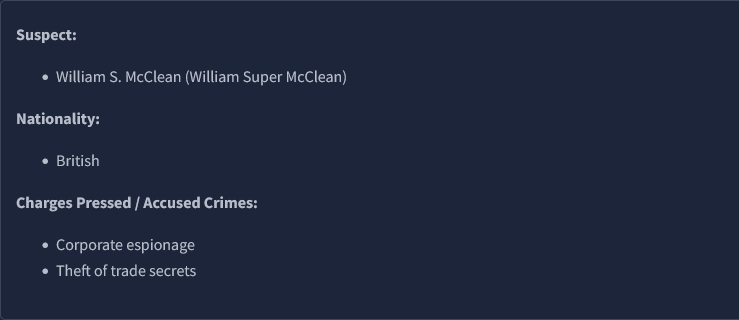

# Challenge Overview
---
**Challenge:** [Digital Forensics Case B4DM755](https://tryhackme.com/room/caseb4dm755)  
**Platform:** TryHackMe  
**Category:** DFIR  
**Difficulty:** Easy  
**Tools:** FTK Imager  

# Summary
---
Write a summary of the CTF challenge.

# Scenario
---
  
 As a Forensics Lab Analyst, you analyse the artefacts from crime scenes. Occasionally, the law enforcement agency you work for receives "intelligence reports" about different cases, and today is one such day. A trusted informant, who has connections to an international crime syndicate, contacted your supervisor about William S. McClean from Case `#B4DM755`.  

The informant provided information about the suspect's whereabouts in Metro Manila, Philippines, which is currently at large, and a transaction that will happen today with a local gang member. They also knew the exact location of the meetup and that the suspect would have incriminating materials at the time.  

The law enforcement agency prepared for the operation by obtaining proper search authority and assigning a DFIR (Digital Forensics & Incident Response) First Responder (i.e., you) to ensure the appropriate acquisition of digital artefacts and evidence for examination at the Forensics Lab, and eventually for use in litigation. The court issued a search warrant on the same day, allowing law enforcement officers to investigate the suspect and his place of residence based on the informant's tip.  

NOTE: In an understaffed agency, one person may be assigned multiple roles, including acquisition and analysis, particularly for high-profile cases. This can help minimize evidence tampering, and ensure accountability as the chain of custody is mainly handled by a single individual (i.e., you).  

# Challenge
---
