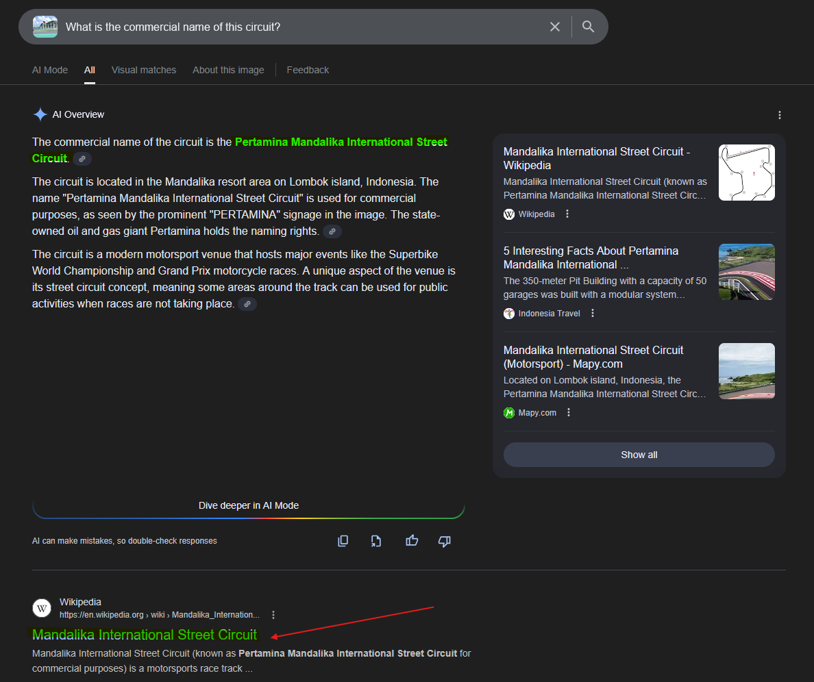
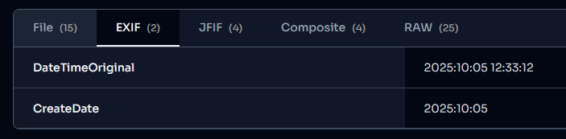
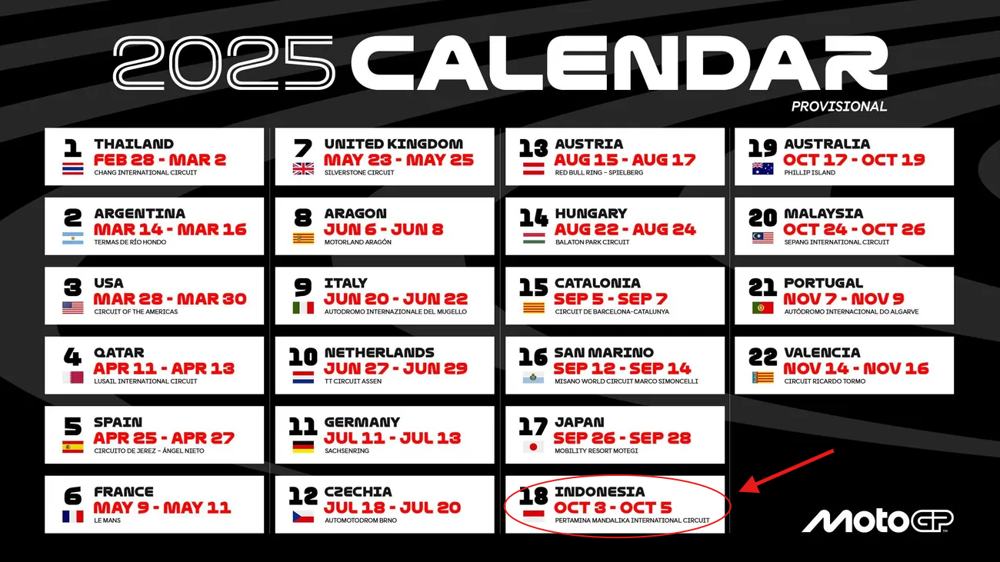
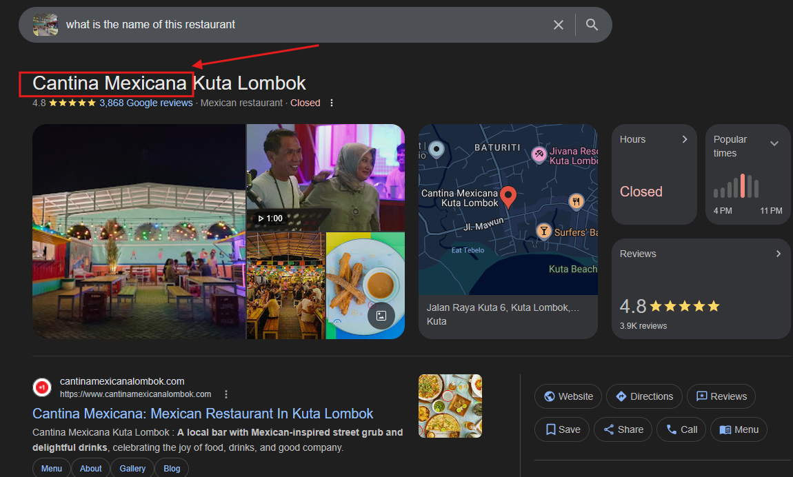
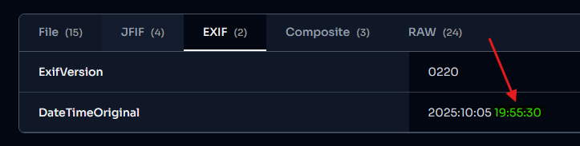
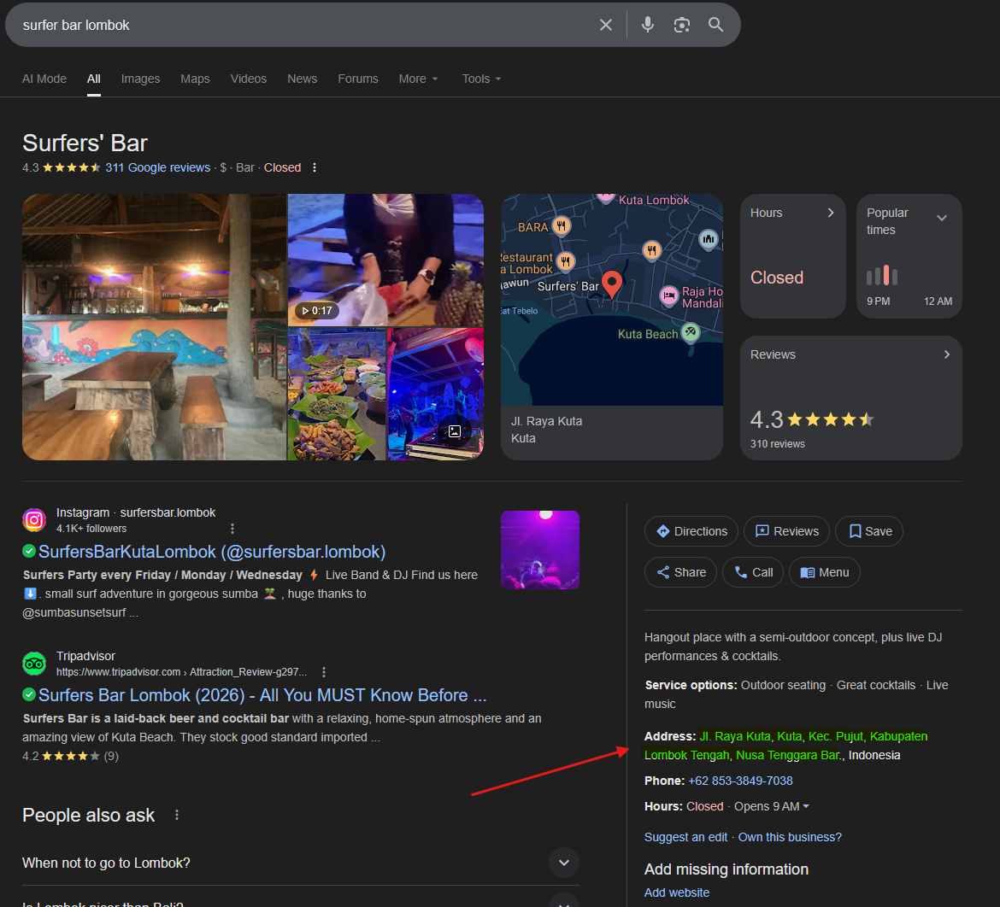
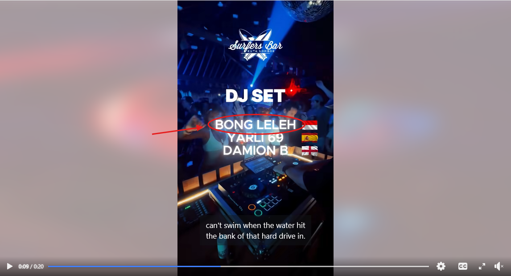
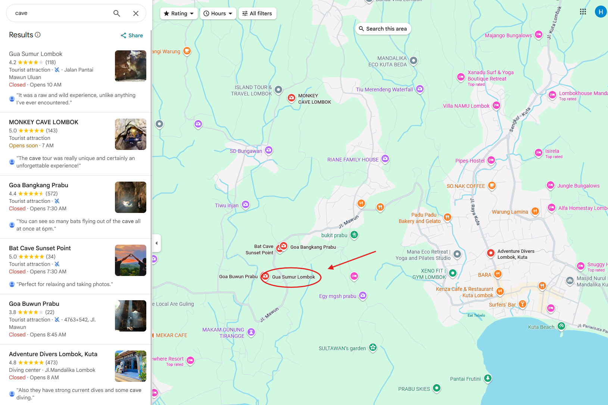
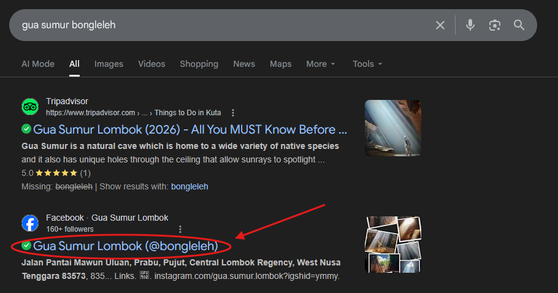
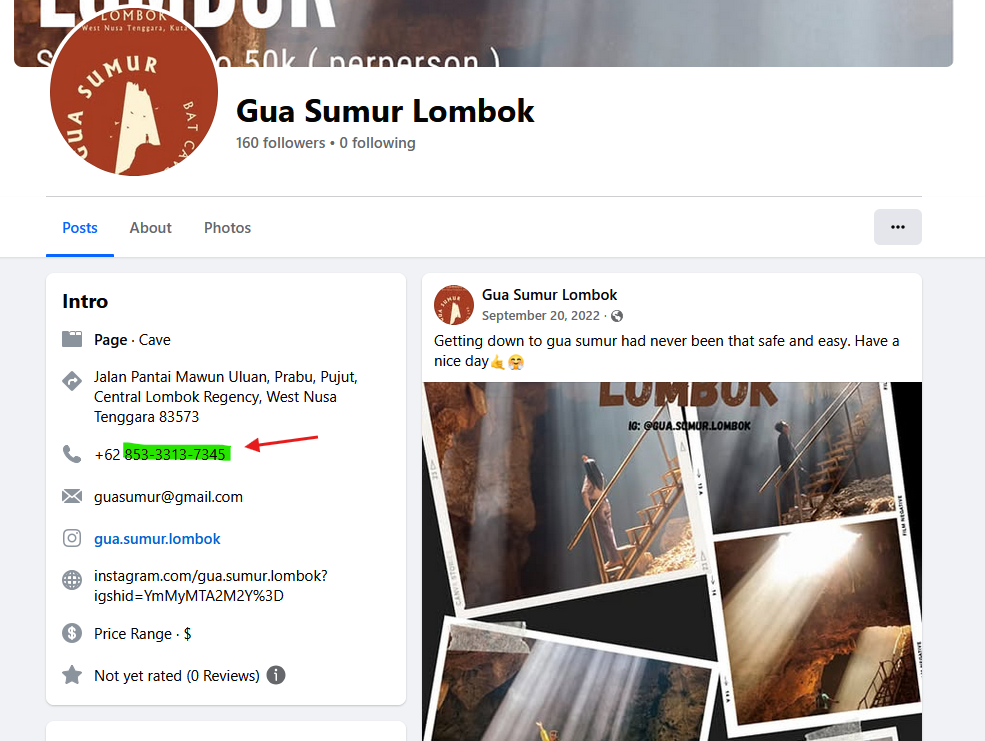

# Challenge Overview
---
**Challenge:** [Missing Person](https://tryhackme.com/room/missingperson)  
**Platform:** TryHackMe  
**Category:** OSINT  
**Difficulty:** Easy  
**Tools Used:** Google Images, exifmeta  

# Summary
---
This lab involved conducting an OSINT investigation to locate a missing person using publicly available information. Analysis of social media profiles, usernames, and online activity revealed key identifiers that linked the individual across multiple platforms. By correlating digital footprints such as profile images, posts, and associated accounts, critical details about the person’s identity and whereabouts were uncovered. The challenge demonstrated how online data can be aggregated to build a complete intelligence picture and support real-world investigations.  

# Scenario
---
My friend went on holiday in 2025 and shared some photos, but I haven’t heard from him since. Can you help me track him down for the police report?  
# Challenge
---
## What is the commercial name of this circuit? Format: English, full commercial name.
  
Upload the MotoGP.jpg image to Google Images and do a reverse image lookup.  

## When did the event take place? Format: DD-DD/MM/YYYY.
  
To find when the event took place, I used the tool `exifmeta.com` to extract metadata from the image. What I am looking for is when this picture was taken to give me a clue on when the event took place.  
From this, I was able to get a clue that the picture was taken on 10/05/2025.  

  
I went to Google and searched for `Pertamina Mandalika International Street Circuit 2025 dates` to try to find official dates of the event.  
I came across the official MotoGP website to find the 2025 calendar, and based on the calendar I can confirm the date from the picture aligned with the official calendar date of 10/03/2025 - 10/05/2025.  

## He told me he ate delicious Mexican food. What is the name of the restaurant?
  
I uploaded the food.jpg to Google Image and did a reverse image lookup.

## At what time was this photo taken? Format: HH:MM:SS.
  
I uploaded food.jpg to exifmeta.com to get the image's metadata to find the original time of the photo.  

## He sent me a message, this is the last I heard from him: ”Went to this cool MotoGP after party, and became friends with one of the local DJs who played that night. We’re going to visit a cave tomorrow.” What is the full address of the bar’s location?
I searched Google for `2025 motogp bar afterparty indonesia` to try to find any indications like advertisement for an afterparty.  
https://www.facebook.com/surfersbarkutalombok/videos/get-ready-for-the-biggest-party-after-the-moto-gp-race%EF%B8%8F-sonday-5-october-2025-at/1447471409699330/  
I came across this Facebook post created by Surfers Bar advertising for a big party after the Moto GP race.

  
I looked up the bar to find the full address.

## What is the DJ's stage name?
  

## What is the name of the cave?
  
I searched around the area of Surfer's Bar for caves.

## What is the phone number linked to his old business? Format: Full number, no country code.
  
I did a Google search of the cave Gua Sumur and the DJ Bongleleh to see if there are any correlations and found a Facebook page for the cave with DJ name.

  
Upon visiting the page, I found the phone number.

