# Challenge Overview
---
**Challenge:** [Snapped Phish-ing Line](https://tryhackme.com/room/snappedphishingline)   
**Platform:** TryHackMe  
**Category:** Phishing Analysis  
**Difficulty:** Easy  
**Tools Used:** VirusTotal, CyberChef, whois, grep, sha256sum

# Summary
---
This lab simulates a phishing incident at a company where multiple employees report suspicious emails and some accounts become compromised. The investigation involves analyzing email samples, attachments, and embedded links to identify malicious indicators and uncover the phishing infrastructure. The lab also includes examining a phishing kit, extracting indicators such as malicious domains and file hashes, and using threat intelligence tools to gather more information about the attacker and campaign.

# Scenario
---
 As an IT department personnel of SwiftSpend Financial, one of your responsibilities is to support your fellow employees with their technical concerns. While everything seemed ordinary and mundane, this gradually changed when several employees from various departments started reporting an unusual email they had received. Unfortunately, some had already submitted their credentials and could no longer log in.

You now proceeded to investigate what is going on by:
1. Analysing the email samples provided by your colleagues.
2. Analysing the URL(s) by browsing it using Firefox.
3. Retrieving the kit used by the adversary.
4. Using -related tooling to gather more information about the adversary.
5. Analysing the kit to gather more information about the adversary.

# Challenge
---
## Who is the individual who received an email attachment containing a PDF?
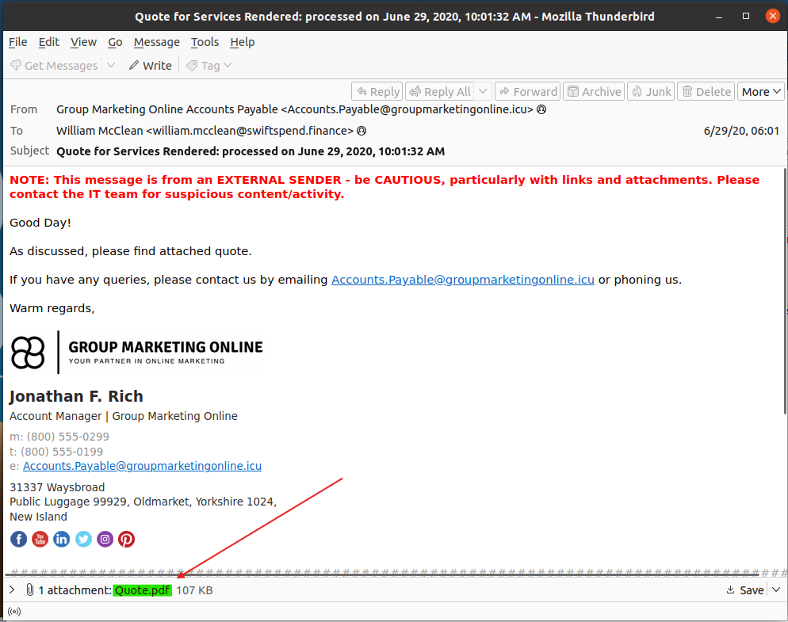  

## What email address was used by the adversary to send the phishing emails?
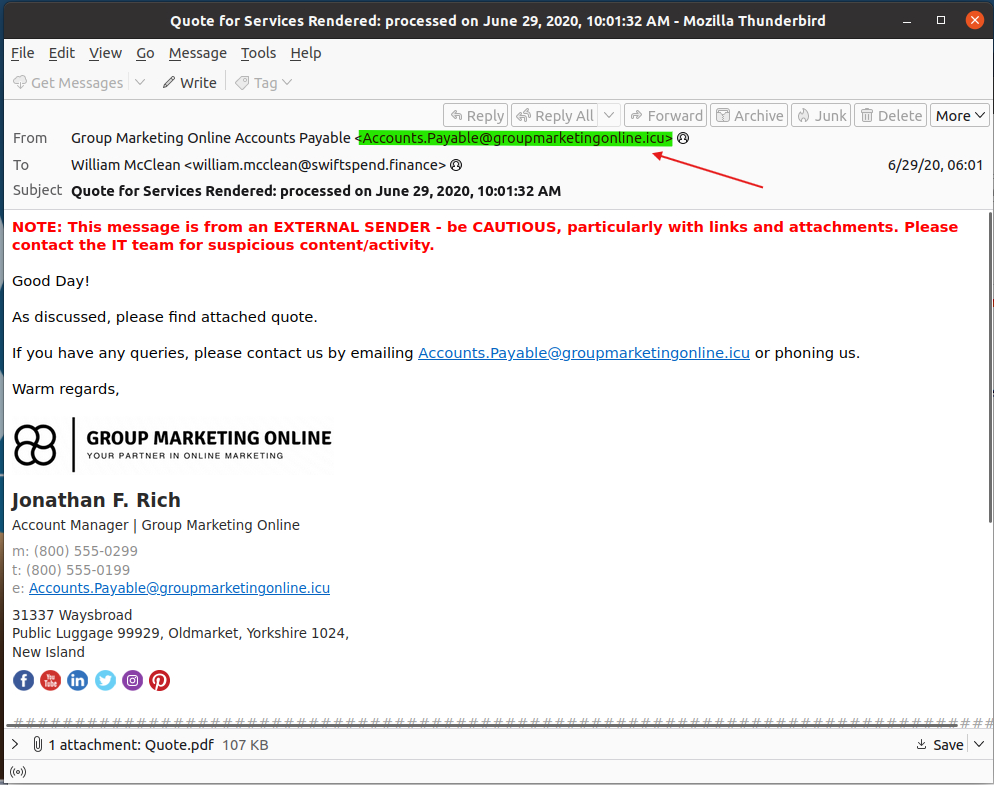  

## What is the redirection URL to the phishing page for the individual Zoe Duncan? (defanged format)
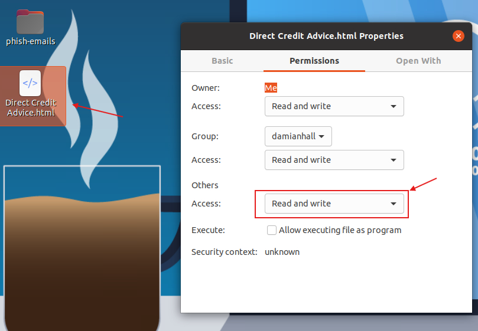  
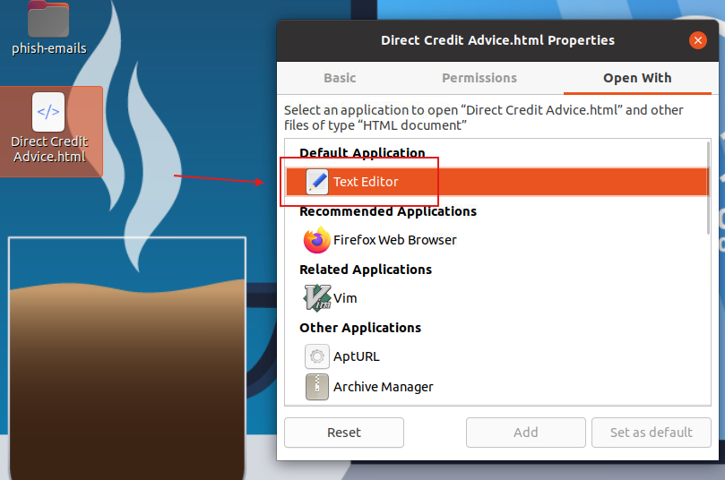  
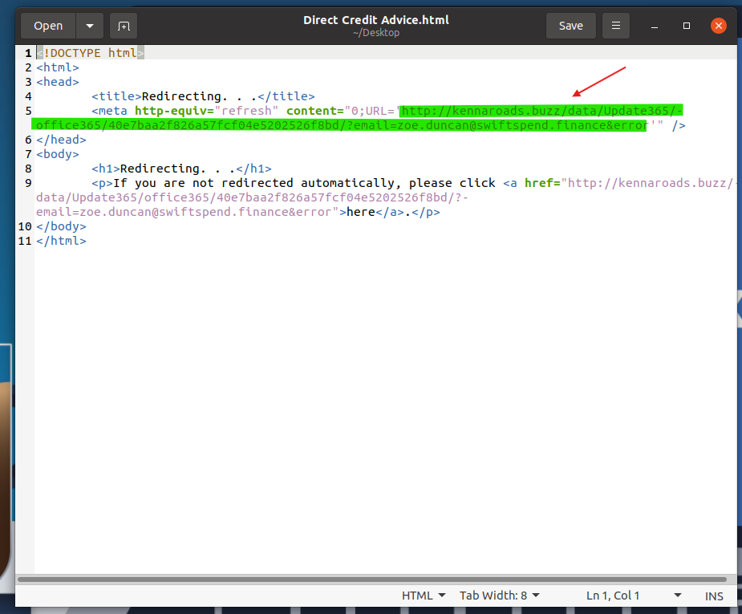  
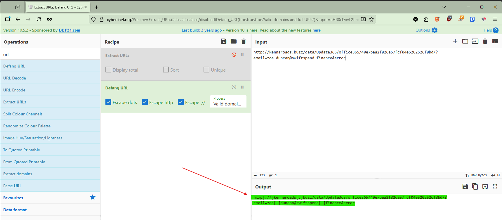  
Use the Defang URL operator in CyberChef to defang the URL.
## What is the URL to the .zip archive of the phishing kit? (defanged format)
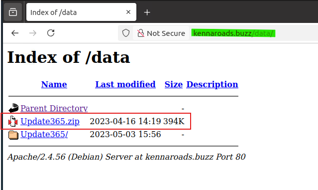  

## What is the SHA256 hash of the phishing kit archive?
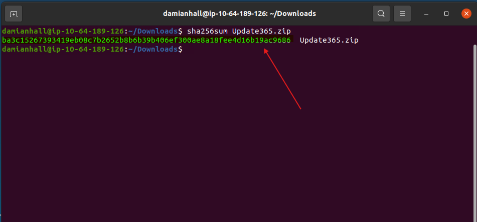  
Download the phishing kit and run the command `sha256sum Update365.zip` to generate the SHA256 hash of the archive.  
## When was the phishing kit archive first submitted? (format: YYYY-MM-DD HH:MM:SS UTC)
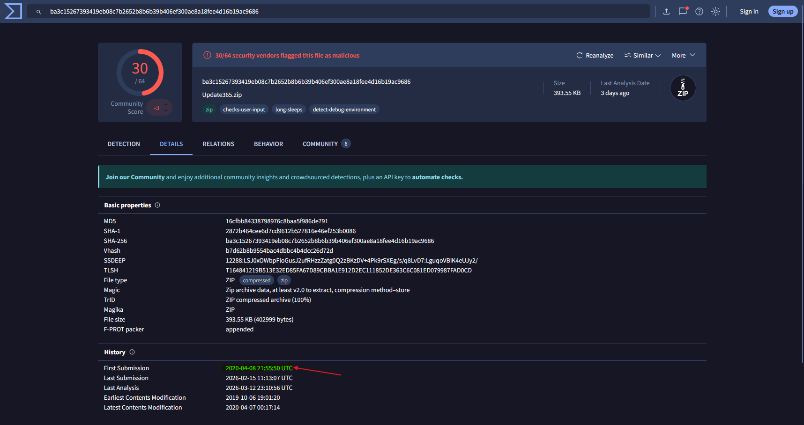  
Copy and paste the SHA256 of the archive into VirusTotal. Then navigate to the Details tab to find the First Submissions date.  
## When was the SSL certificate the phishing domain used to host the phishing kit archive first logged? (format: YYYY-MM-DD)
SSL Certificate is no longer available to reliably answer this question. ANS: "2020-06-25".

## What was the email address of the user who submitted their password twice?
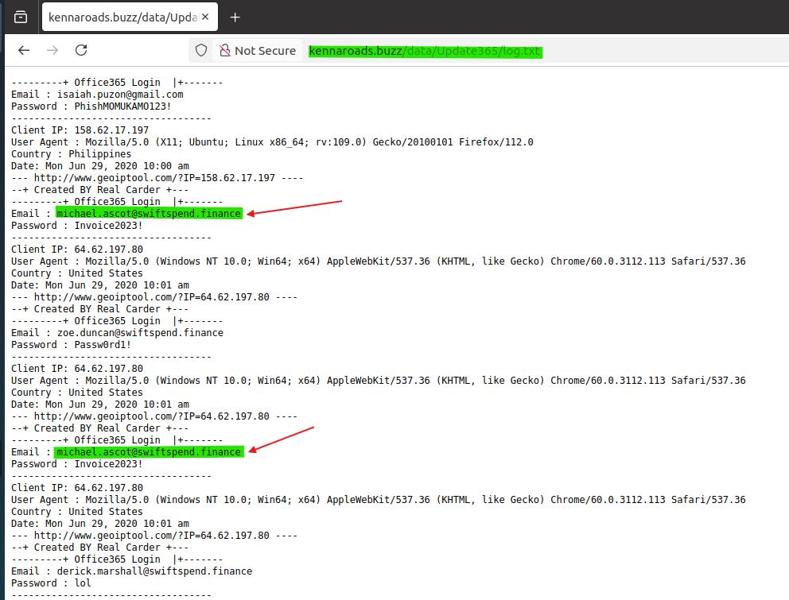  
Enumerate the directory to find log.txt.  
## What was the email address used by the adversary to collect compromised credentials?
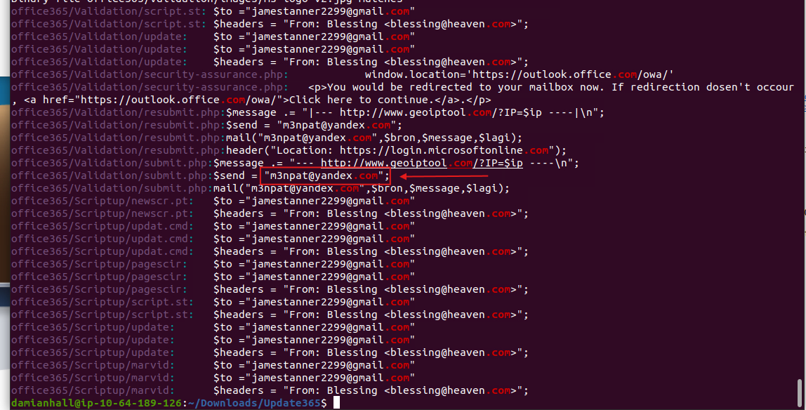  
Download the phishing kit and unzip the file.  
Then `cd` into Update365 and run the command `grep -r ".com" office365` to search the `office365` directory for any strings containing `.com`.  
## The adversary used other email addresses in the obtained phishing kit. What is the email address that ends in "@gmail.com"?
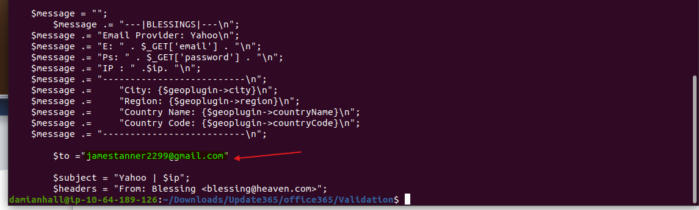
Run the command `grep -r ".com" office365` to search the `office365` directory for any strings containing `.com`.  
## What is the hidden flag?
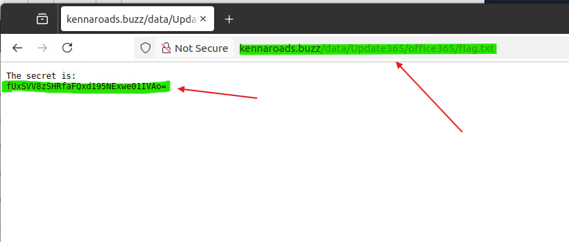  
Enumerate the directory to find flag.txt.

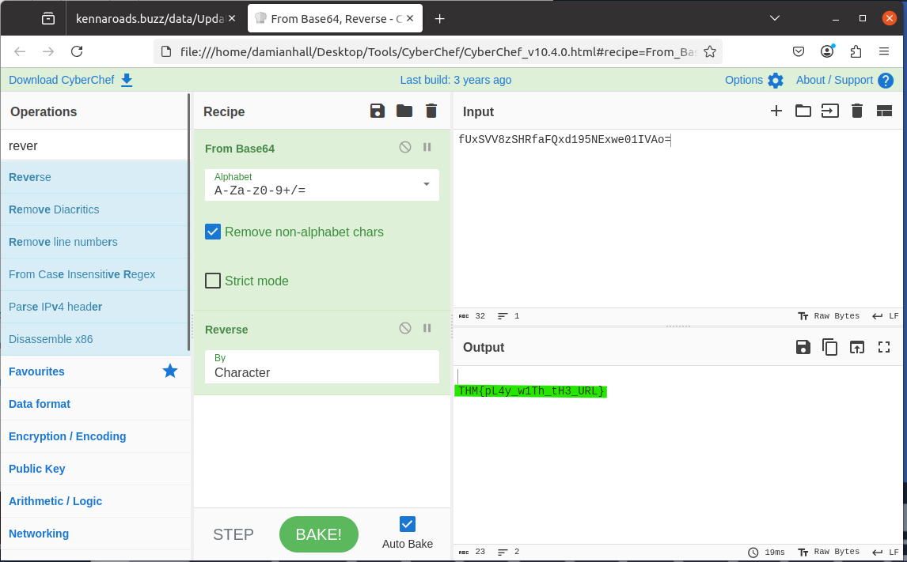  
Copy and paste the secret in to CyberChef, decode the base64, and reverse the output to obtain the secret flag.