# Challenge Overview
---
**Challenge:** [Summit](https://tryhackme.com/room/summit)  
**Platform:** TryHackMe  
**Category:** Log Analysis  
**Difficulty:** Easy  
**Tools:** MITRE ATT&CK, Pyramid of Pain  

# Summary
---
This lab involves working with an external penetration tester to simulate malware attacks and improve detection capabilities. The penetration tester will send a series of malware samples which we will execute in a malware sandbox and determine how to detect and block the malware. With each iteration, the malware becomes more sophisticated, requiring deeper analysis and improved detection strategies.

# Scenario
---
After participating in one too many incident response activities, PicoSecure has decided to conduct a threat simulation and detection engineering engagement to bolster its malware detection capabilities. You have been assigned to work with an external penetration tester in an iterative purple-team scenario. The tester will be attempting to execute malware samples on a simulated internal user workstation. At the same time, you will need to configure PicoSecure's security tools to detect and prevent the malware from executing.

# Challenge
---
## What is the first flag you receive after successfully detecting sample1.exe?

At the most basic level of the Pyramid of Pain, malware hash values are very easy for malicious actors to operate around because they can generate a completely new hash with only minor changes to the file.  
In this email, we received our first sample malware called `sample1.exe.`  
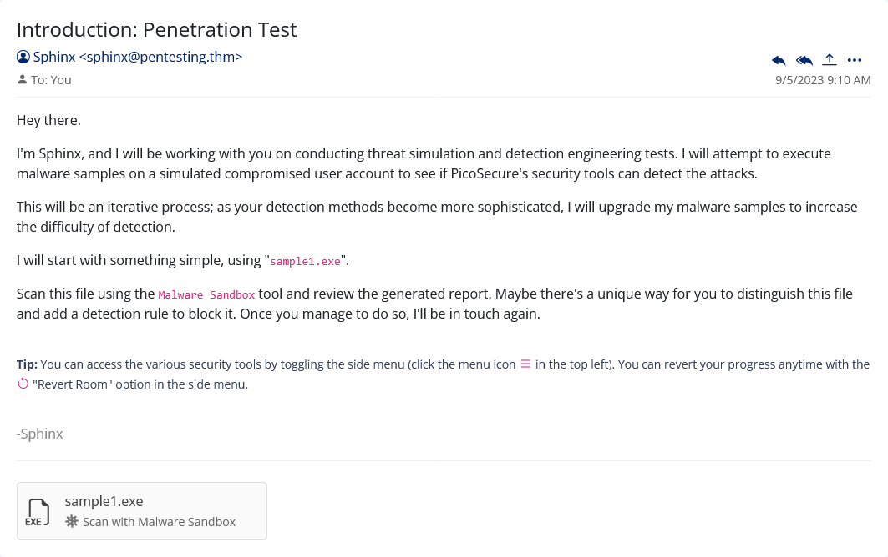  

We will navigate to the Malware Sandbox to submit `sample1.exe` for analysis. Select `sample1.exe` as the file and submit for analysis.  
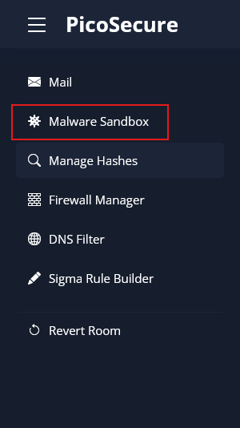  

After the analysis completes, we can observe some useful information like all of the hashes for the malware.  
Considering that this sample malware is not very sophisticated, we add the malware's MD5 hash to our hash blocklist to block the malware from executing.  
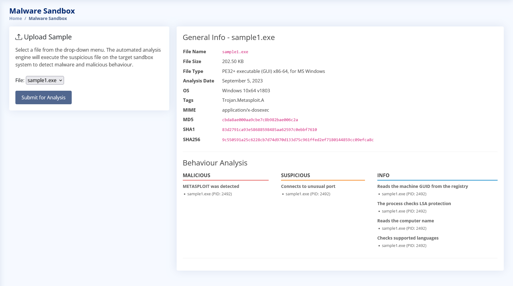  

Navigate to "Manage Hashes" then select MD5 for the hash algorithm and paste in the hash value `cbda8ae000aa9cbe7c8b982bae006c2a` provided from the malware analysis scan.  
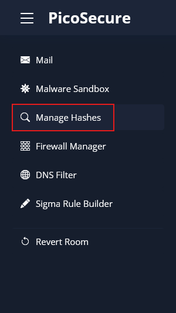  

By blocking the MD5 hash of the malware, we are forcing the malicious actors to increase their effort by modifying/recompiling the malware to generate a new hash.  
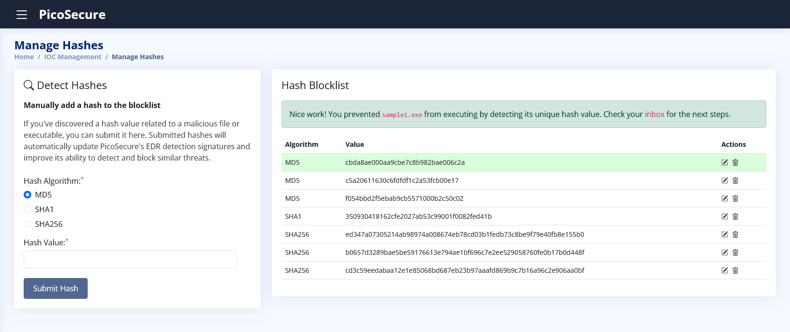  

Submit the hash to receive the flag.  

## What is the second flag you receive after successfully detecting sample2.exe?

Moving up the Pyramid of Pain, the next level involves detecting or blocking IP addresses associated with the attacker’s infrastructure.  
In this email, the penetration tester increased malware sophistication and provided `sample2.exe`.  
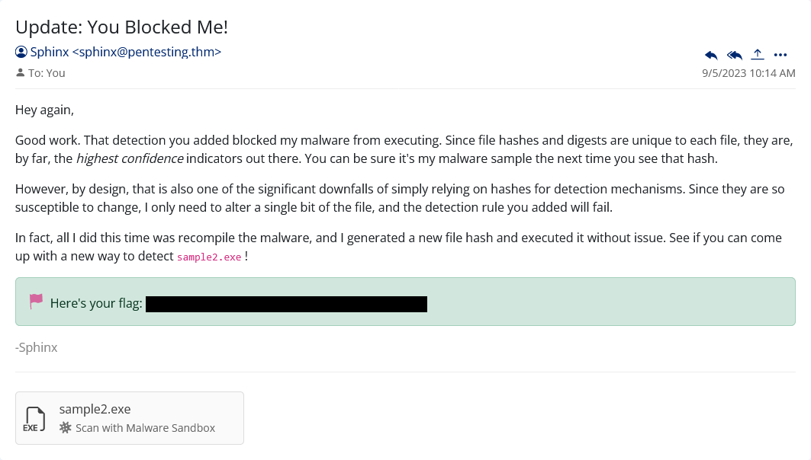  
> Note: The flag received in this email is for the previous question.

The sandbox analysis shows that `sample2.exe` initiates outbound network connection to `154.35.10.133:4444` shortly after execution. This indicates that the binary is attempting to communicate with an external system.  

We can also observe that the binary establishes other network connections to `40.97.128.3:443` and `40.97.128.3:443` belonging to Microsoft Corporation. This may indicate the binary is performing connectivity checks or attempting to blend malicious traffic.  
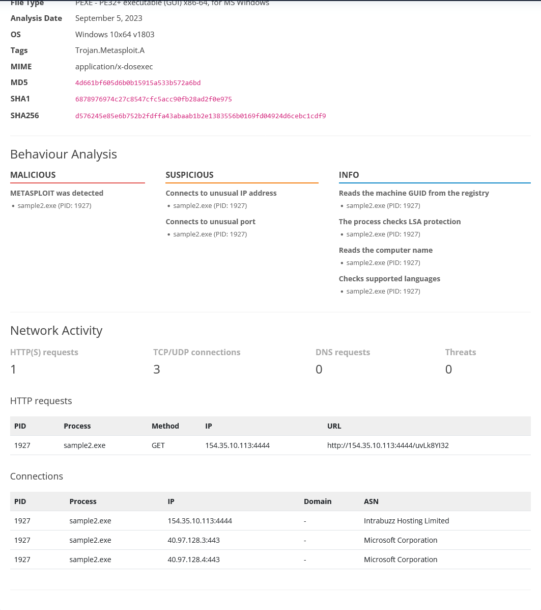  

To prevent any network connections to the malicious IP address, navigate to the "Firewall Manager" and create a new firewall rule.  
- Type will be `Egress` as we are targeting internal systems traffic to external systems.  
- The source IP will be `Any` meaning the rule will apply to any internal systems.  
- The destination IP will be the malicious IP address`154.35.10.113`.  
- The action will be `Block` because we want to block any connection attempts to the malicious IP address.  
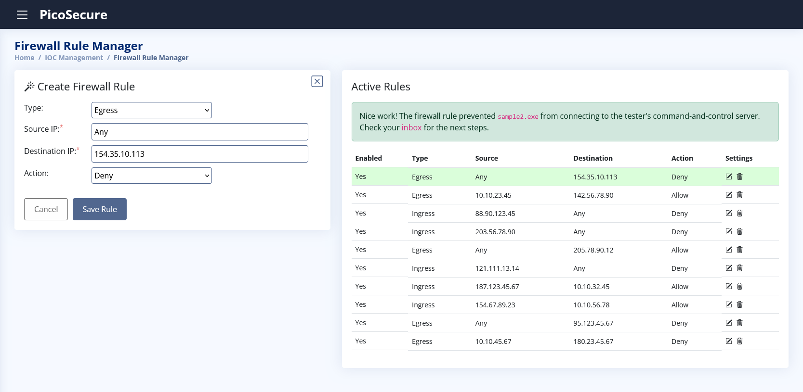  

By creating a firewall rule to block the IP address associated with the attack, we force the malicious actors to change the network infrastructure used to communicate with compromised systems.  

Save the rule to receive the flag.  

## What is the third flag you receive after successfully detecting sample3.exe?

Moving up the Pyramid of Pain, the next level involves detecting or blocking domain names associated with the attacker’s infrastructure.  
In this email, the penetration tester increased malware sophistication and provided `sample3.exe`.  
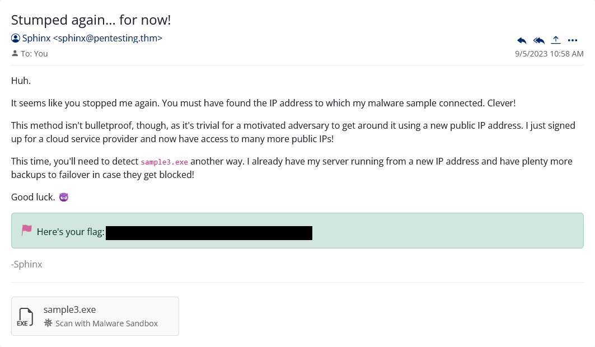  
> Note: The flag received in this email is for the previous question.

The sandbox analysis shows suspicious outbound connections created by the process `sample3.exe`. The process performs HTTP GET requests to the domain `emudyn.bresonicz.info` at IP address `62.123.140.9`, using ports 1337 and 80.  
One request downloads `backdoor.exe`, indicating that the malware is retrieving a secondary payload from a C2 server.  
After the download, `backdoor.exe` appears as a new process and continues communicating with the same domain.  

This suggests the initial file acts as a dropper, installing a backdoor and establishing external communication with the attacker’s infrastructure.  
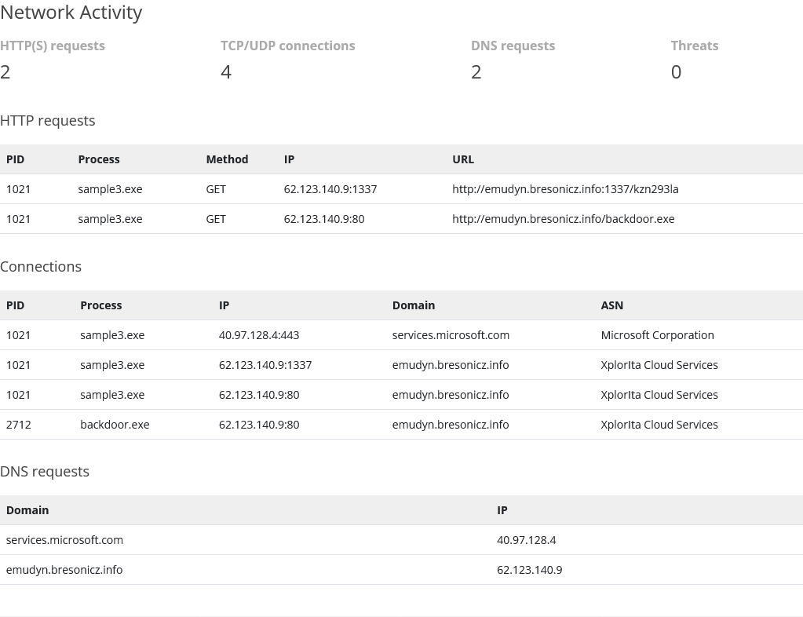  

To block this malicious domain, navigate to the "DNS Filter" and create a new DNS rule.  
- Category is `Botnet` as this indicates C2 communication activity.  
- Paste the domain `emudyn.bresonicz.info` into the Domain Name field.  
- Action is `Deny` to block connections to the domain.  
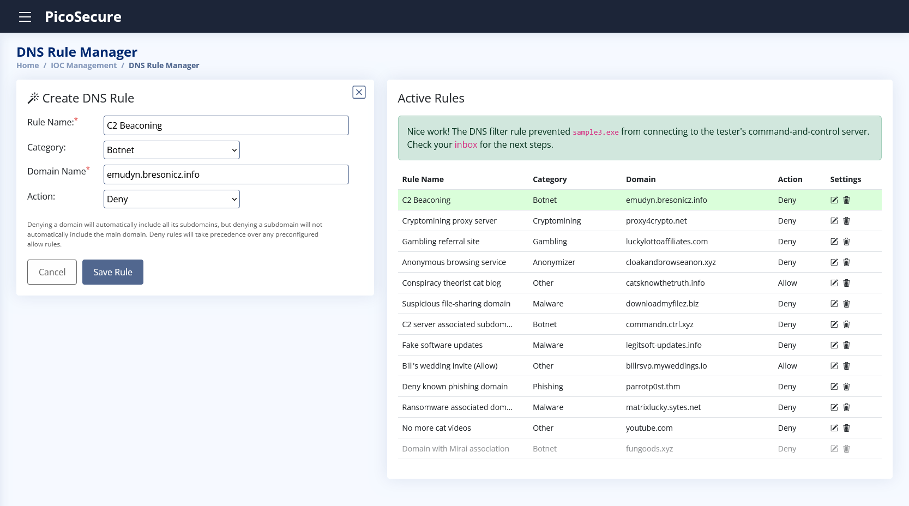  

By creating a DNS rule to block the malicious domain `emudyn.bresonicz.info`, defenders can prevent infected systems from resolving the domain to its IP address `62.123.140.9`.  

Save the rule to receive the flag.  

## What is the fourth flag you receive after successfully detecting sample4.exe?

Moving up the Pyramid of Pain, the next level focuses on network and host artifacts, such as suspicious file paths, registry keys, or unusual process behavior left behind by malware during execution.  
In this email, the penetration tester increased malware sophistication and provided `sample4.exe`.  
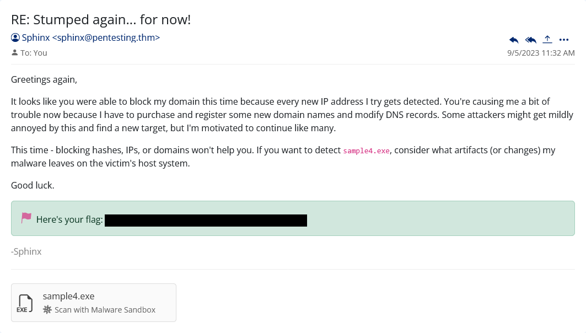  
> Note: The flag received in this email is for the previous question.

The sandbox analysis shows registry activity made by `sample4.exe` where it modifies the key `HKEY_LOCAL_MACHINE\SOFTWARE\Microsoft\Windows Defender\Real-Time Protection` and sets `DisableRealtimeMonitoring = 1`.  
This change disables the Microsoft Defender's real-time protection which will allow the malware to run without being detected.  
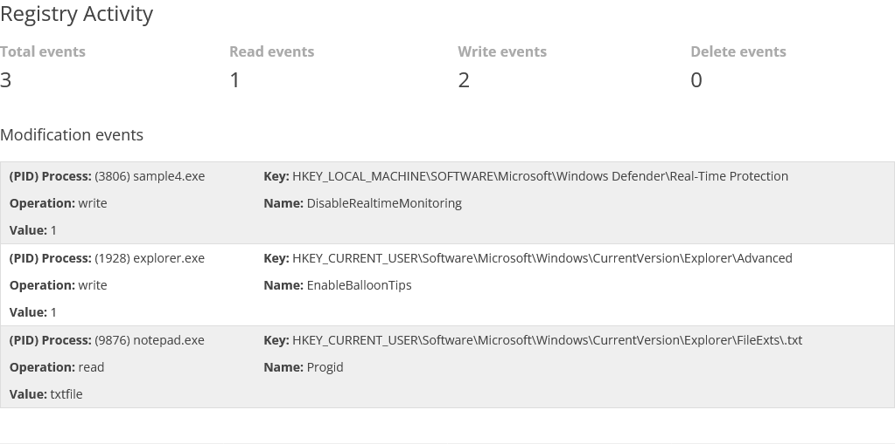  

Navigate to "Sigma Rule Builder" and select Sysmon Event Logs.  
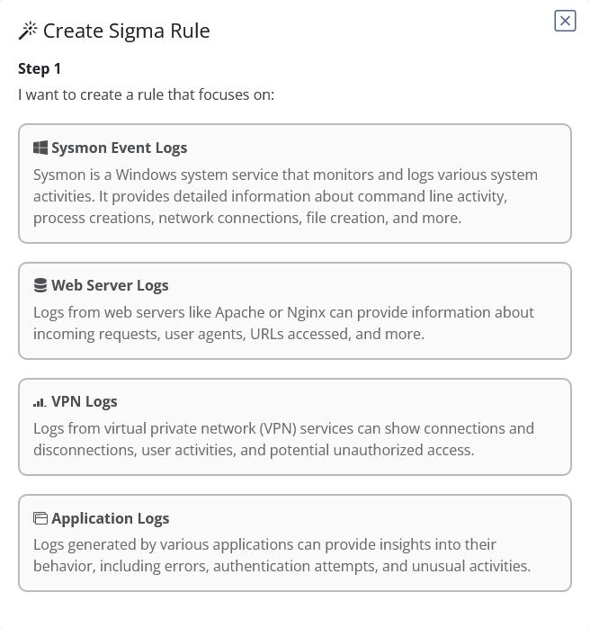  

Select Registry Modifications.  
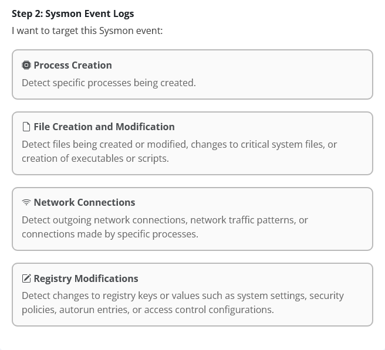  

The ATT&CK ID is `Defense Evasion (TA0005)` because this registry modification is attempting to prevent the malware from being detected by Microsoft Defender.  
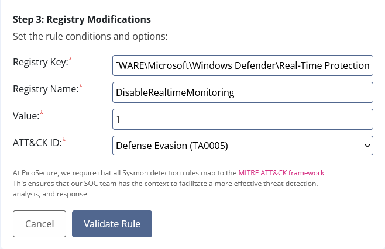  
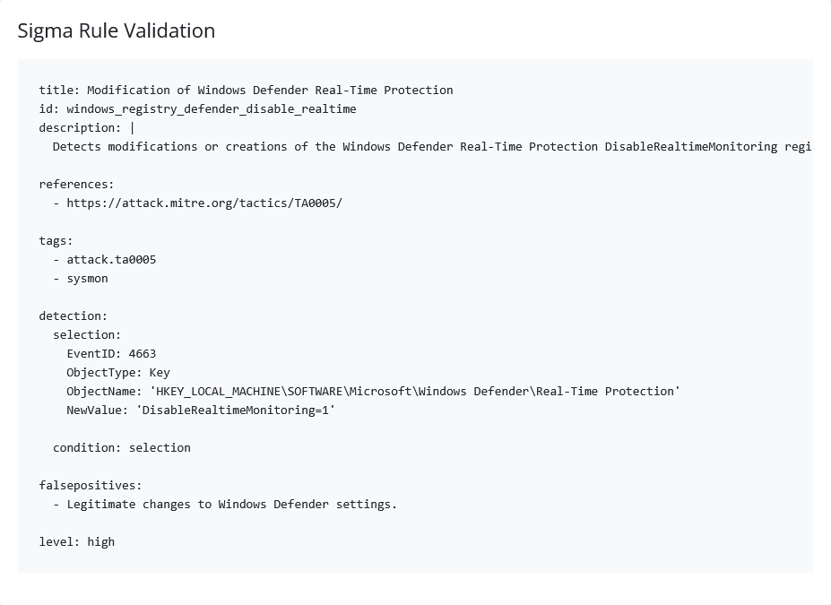  

By creating a registry modification detection rule to monitor changes to the registry key `DisableRealtimeMonitoring`, defenders can detect when a process attempts to disable Windows Defender’s real-time protection.  

Validate the rule to retrieve the flag.  

## What is the fifth flag you receive after successfully detecting sample5.exe?

By moving further up the Pyramid of Pain, defenders begin focusing on tools used by the attacker, rather than individual indicators.  
In this email, the penetration tester provided a network log file `outgoing_connections.log`.  
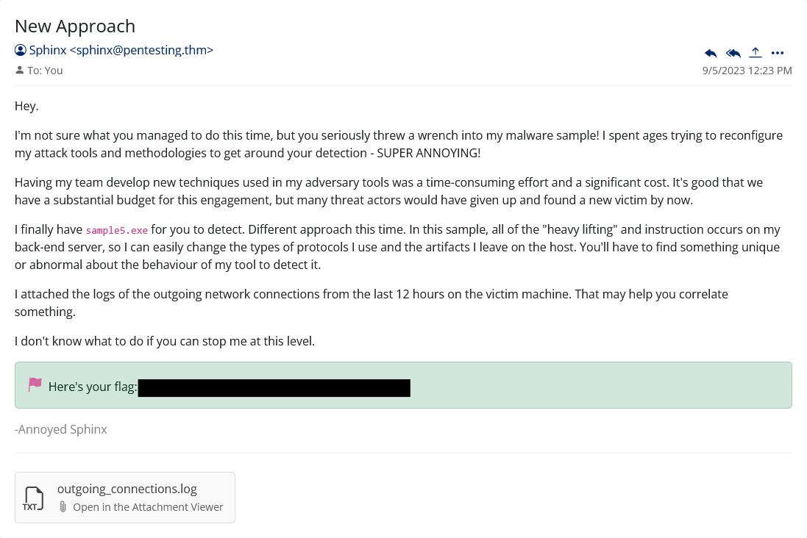  
> Note: The flag received in this email is for the previous question.

Based on the `outgoing_connections.log`, we see something very interesting. There is constant outgoing connections made to `51.102.10.19` on port `443` sending size of 97 bytes at regular 30 minute intervals throughout day.  
This pattern suggests periodic beaconing behavior, indicating the infected system may be maintaining a persistent connection with an attacker-controlled server to receive commands or send status updates.  
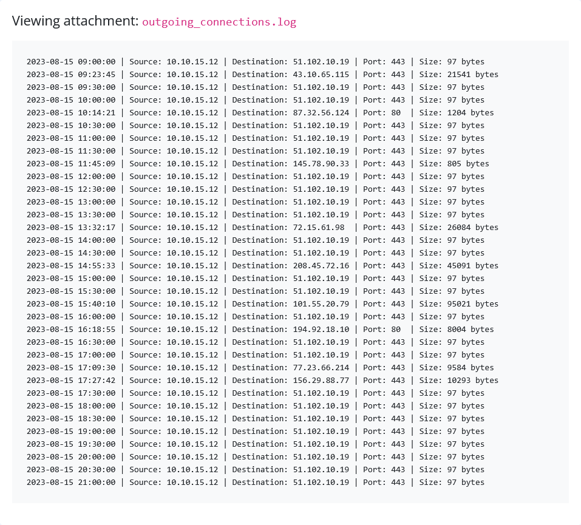  

Navigate to "Sigma Rule Builder" and select Sysmon Event Logs.  
  

Select Network Connections.  
  

- Remote IP: `Any`, because note that the malware is currently very sophisticated is using multiple servers.  
- Remote IP: `Any`, for the same reason.  
- Size (bytes): `97`  
- Frequency (seconds): `1800`  
- ATT&CK ID: `Command and Control (TA0011)`, the outgoing_connections.log shows repeated outbound connections consistent with C2 beaconing behavior.  
This rule will target any malicious IP and port that attempts to establish command-and-control communication with the infected host.  
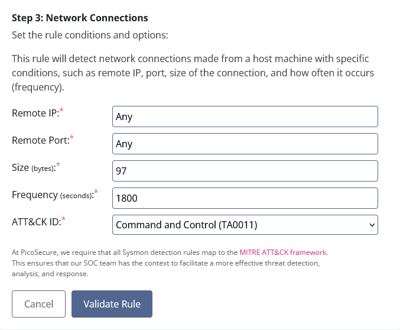  
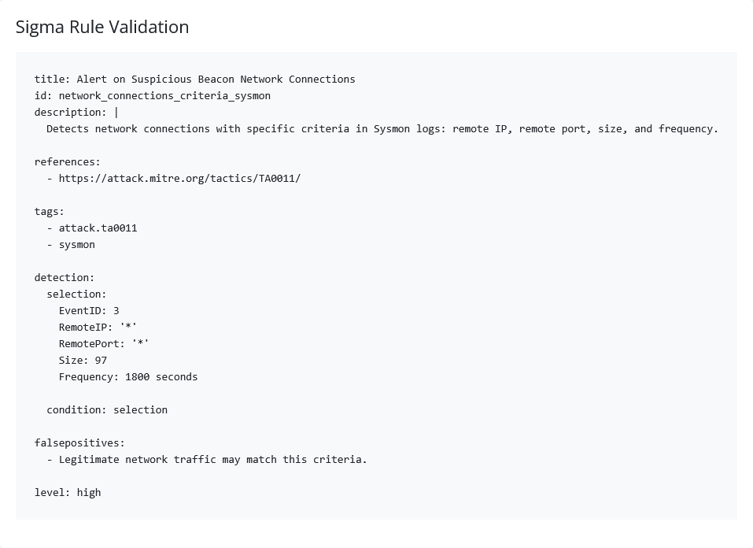  

By creating a detection rule that identifies regular outbound connections with small, consistent data sizes, defenders can detect potential command-and-control beaconing behavior. The repeated 97 byte transmissions at fixed 30 minute intervals suggest automated communication between the infected host and an attacker-controlled server.  

Validate the rule to retrieve the flag.  

## What is the final flag you receive from Sphinx?

Moving up to the last level of the Pyramid of Pain, defenders begin detecting the attacker’s tactics, techniques, and procedures (TTPs). Detecting these behaviors forces attackers to significantly change how their malware operates, which requires far more effort than simply changing hashes, IP addresses, or domains.  
In this email, the penetration tester provided a log file `commands.log`.  
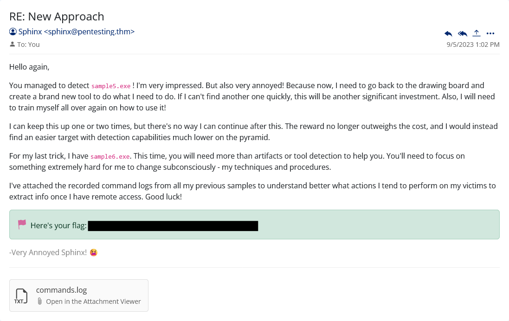  
> Note: The flag received in this email is for the previous question.

The `commands.log` shows that cmd.exe is executing multiple system reconnaissance commands like `systeminfo`, `ipconfig /all,` `netstat -ano`, and directory listings across several folders.  
The output of these commands is redirected into `%temp%\exfiltr8.log`, indicating the attacker is collecting system and network information into a single file for potential data exfiltration.  
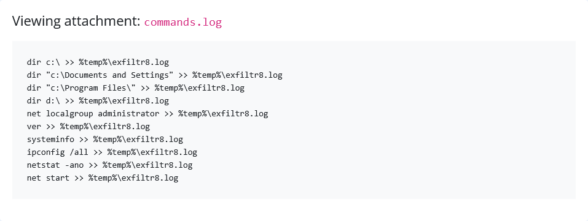  

Navigate to "Sigma Rule Builder" and select Sysmon Event Logs.  
  

Select Process Creation.  
  

- Set the Process Name to `cmd.exe` as the malicious actor is using this process to execute commands.  
- Set the string to `%temp%\exfiltr8.log` to detect any command redirections to this log file.  
- The ATT&CK ID is `Exfiltration (TA0010)` since the attacker is preparing gathered information to be extracted from the compromised system.  
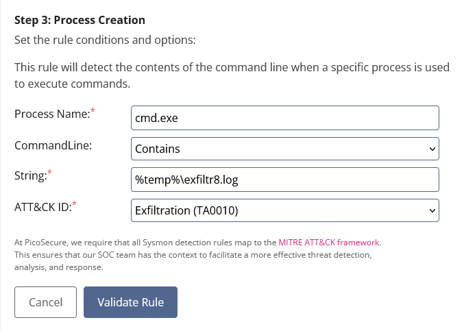  

By creating a detection rule that monitors when `cmd.exe` executes commands redirecting output to `%temp%\exfiltr8.log`, defenders can identify suspicious system reconnaissance and data collection activity.  

Validate the rule to retrieve the flag.  

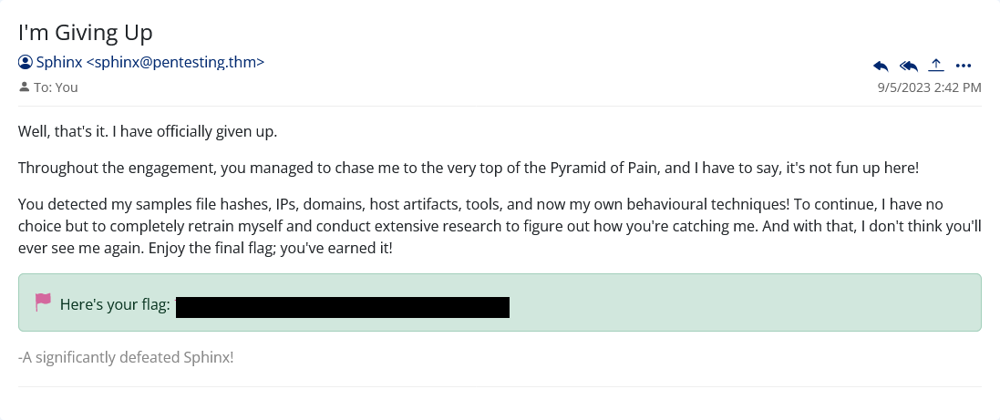
