# Challenge Overview
---
**Challenge:** [The Greenholt Phish](https://tryhackme.com/room/phishingemails5fgjlzxc)    
**Platform:** TryHackMe  
**Category:** Phishing Analysis  
**Difficulty:**  Easy  
**Tools:**  whois, VirusTotal

# Summary
---
This lab focuses on analyzing phishing email samples to identify indicators of malicious messages. By examining email headers, sender addresses, links, and attachments, the lab demonstrates how attackers use techniques such as spoofed domains, brand impersonation, and urgent language to trick users into clicking malicious links or revealing credentials.

# Scenario
---
A Sales Executive at Greenholt received an email that he didn't expect to receive from a customer. He claims that the customer never uses generic greetings such as "Good day" and didn't expect any amount of money to be transferred to his account. The email also contains an attachment that he never requested. He forwarded the email to the (Security Operations Center) department for further investigation. 

Investigate the email sample to determine if it is legitimate. 

# Challenge
---
## What is the Transfer Reference Number listed in the email's Subject?
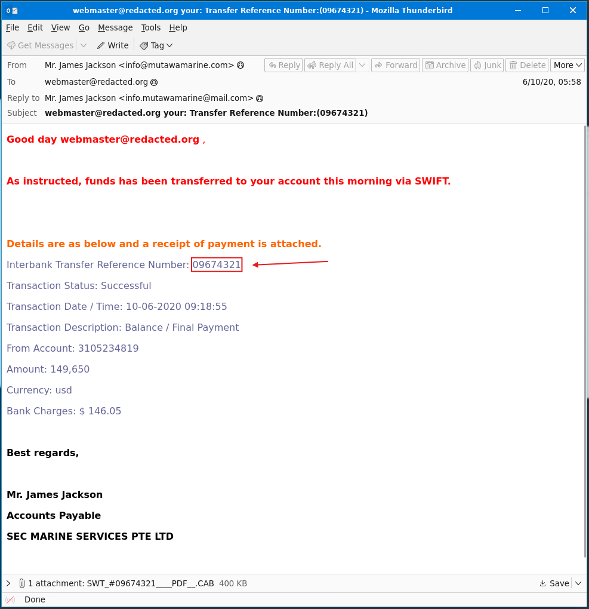

## Who is the email from?
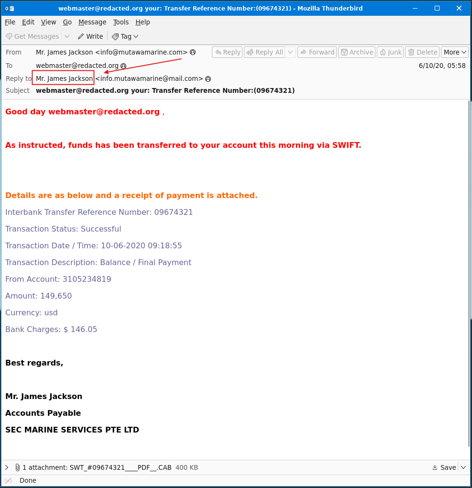

## What is his email address?
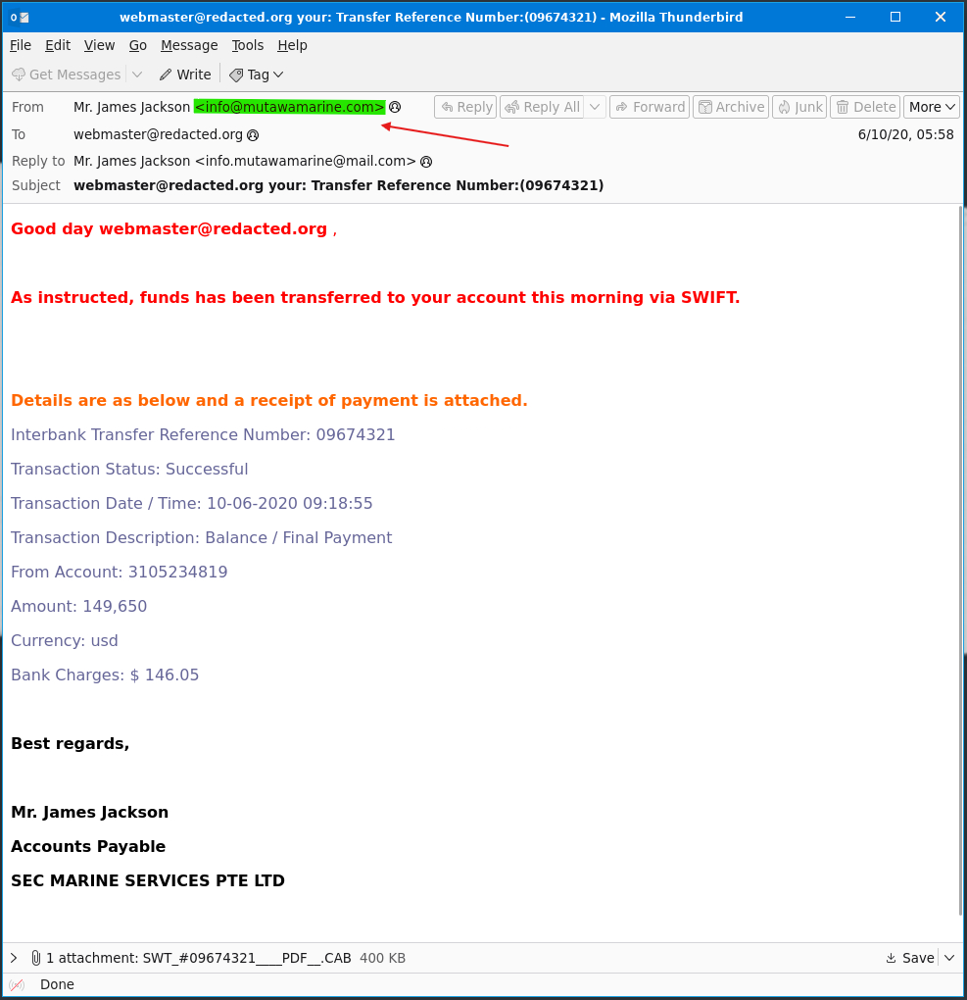  

## What email address will receive a reply to this email? 
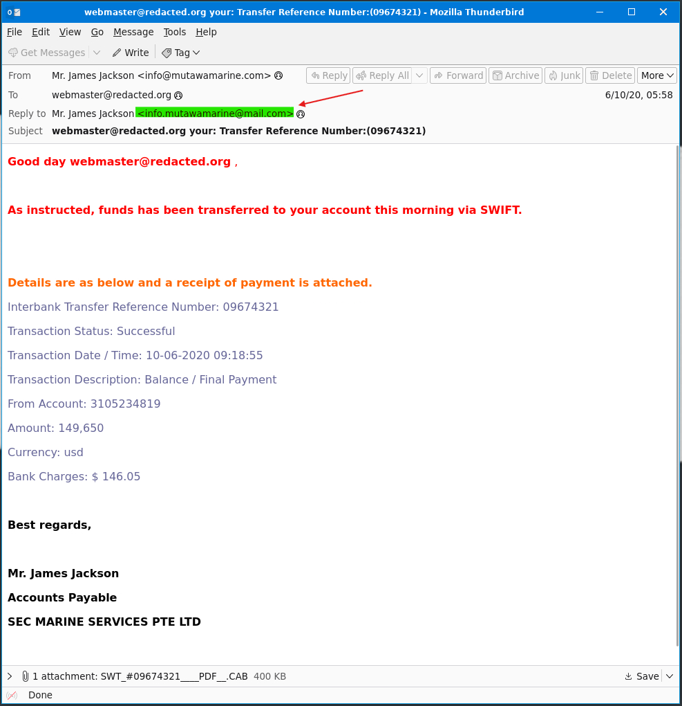

## What is the Originating IP?
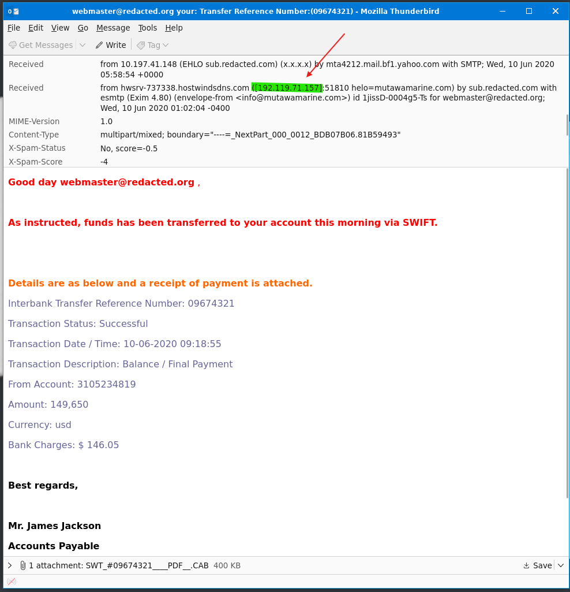  

##  Who is the owner of the Originating IP? (Do not include the "." in your answer.)
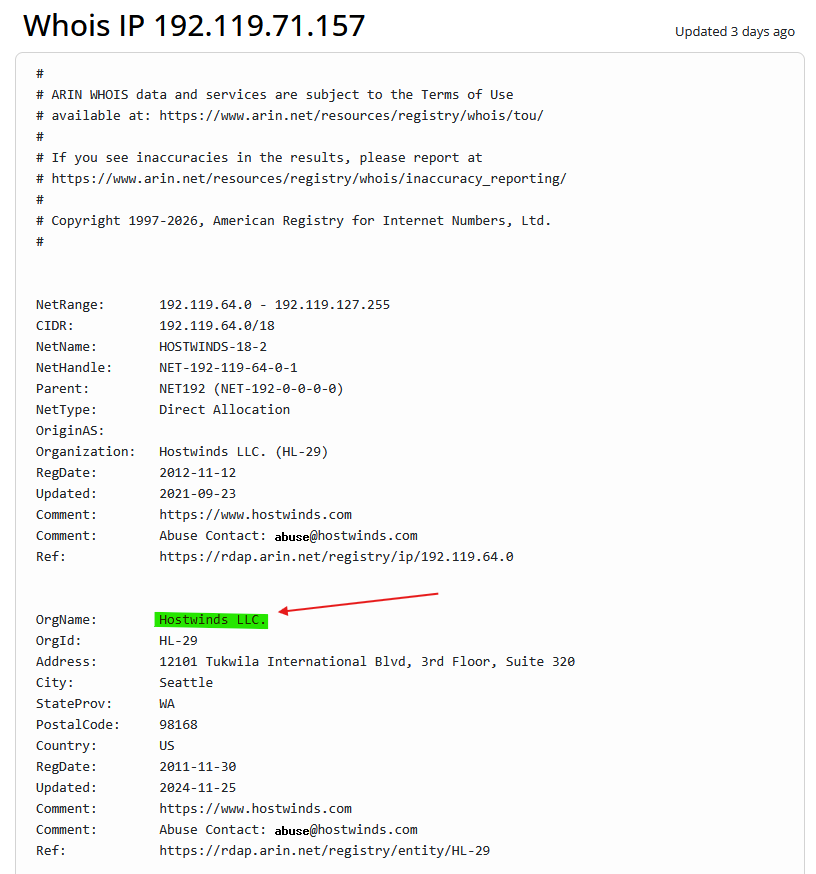  
Perform a WHOIS lookup of the IP address.
##  What is the SPF record for the Return-Path domain?
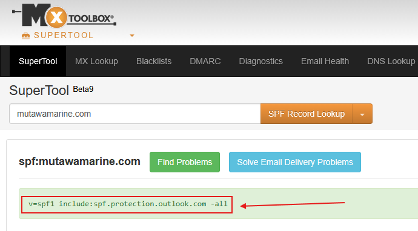  
Copy the Return-Path domain, search in Google `SPF record lookup`, and use an SPF record lookup tool.
##  What is the DMARC record for the Return-Path domain?
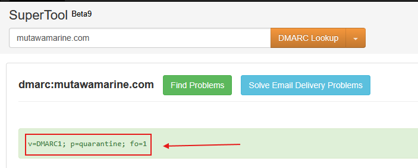  
Copy the Return-Path domain, search in Google `DMARC domain lookup`, and use a DMARC domain lookup tool.
##  What is the name of the attachment?
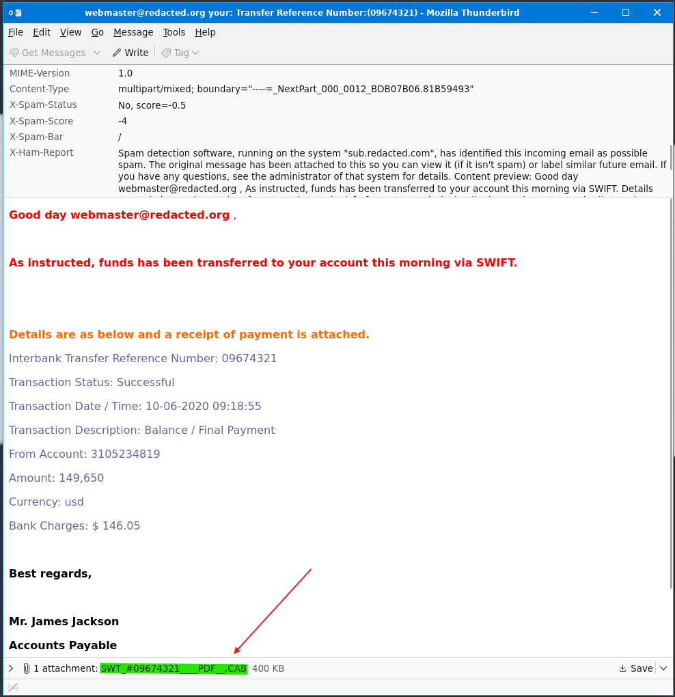

## What is the SHA256 hash of the file attachment?
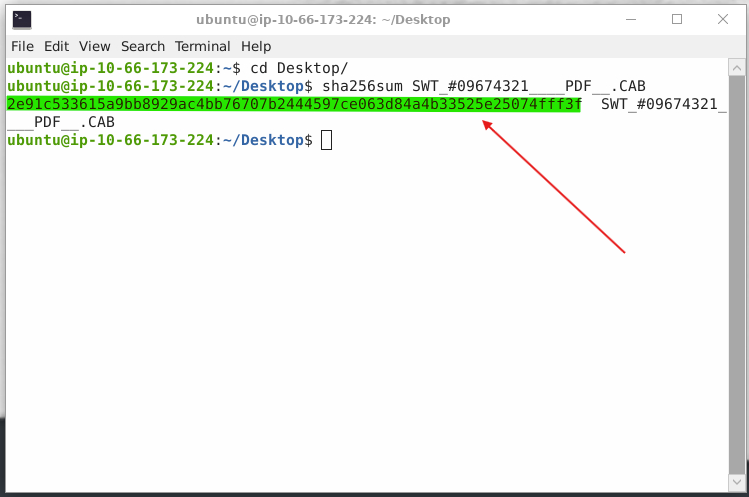  
Save the attachment to the Desktop, open the terminal and run the command: `sha256sum SWT_#09674321____PDF__.CAB` to obtain the SHA256 hash of the file attachment.  

## What is the attachments file size? (Don't forget to add "KB" to your answer, NUM KB)
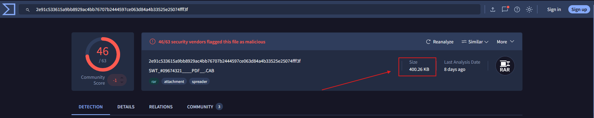  
Copy and paste the SHA256 hash of the file into virus total to find the size.

## What is the actual file extension of the attachment?
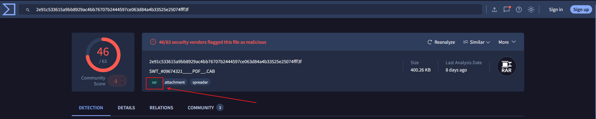  
Copy and paste the SHA256 hash of the file into virus total to find the actual file extension.